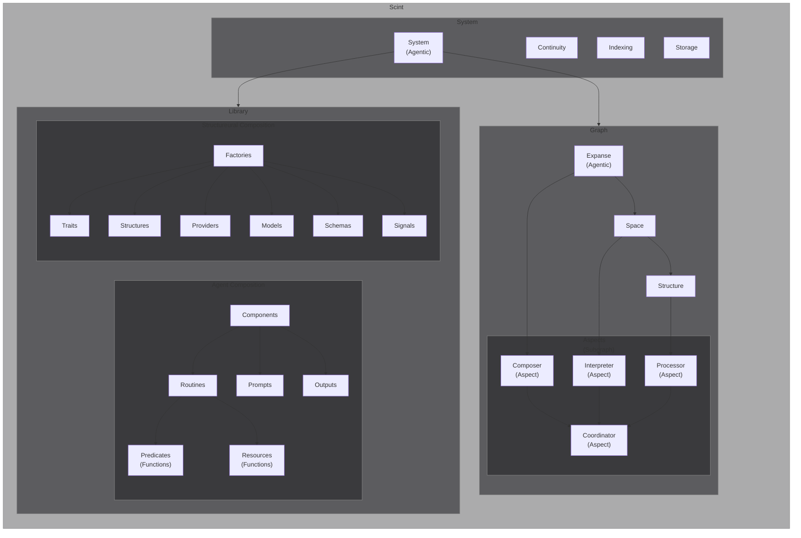

# Scint

A modular Python framework for building runtime-composable AI systems. Scint integrates Aspects, Structures, Traits, Models, Schemas, and Signals, all unified by a Library of tools and a Continuity layer for long-term memory and state management.

## Overview

Scint enables creation of sophisticated AI systems by combining structured memory and state management (via Continuity) with an ensemble of Aspects—each focusing on a different function. Structures and Traits model your domain in a modular way. Whether orchestrating complex workflows or reasoning over large graphs, Scint's composable foundation helps you scale up and adapt at runtime.

## Key Features

- **Runtime Composability**
  Hot-swap Aspects, Traits, or external Providers without restarting the entire system.

- **Unified Memory**
  Continuity ensures shared context and state, enabling smooth collaboration between Aspects.

- **Flexible Domain Modeling**
  Use Structures plus attachable Traits to represent anything from filesystem objects to code-boundaries to ephemeral conversation nodes.

- **Schema-Driven Validation**
  Maintain data coherence with Models and Schemas, both fully optional and easy to extend.

- **Signals for Reactivity**
  Enable system components to subscribe, observe, or react whenever key events or state changes occur.

## Architecture

### Library

A central repository of reusable tools, capabilities, and customizations. The Library's pluggable design allows introduction of new functions, expansions, or AI behaviors without disrupting existing flows.

```markdown
flowchart LR
    PRV["Providers"]
    SRV["Services"]
    subgraph CMP
        TOA["Assemblies"]
        TOL["Tools"]
        INS["Instructions"]

    end

    subgraph Schemas
        CST["Structures"]
        TRT["Traits"]
        MDL["Models"]
        OTP["Outputs"]
    end

    Library --> Aspects & Composition
    Aspects --> INS & TOL & OTP
    Composition --> CST & PRV & SRV
    TOL --> TOA
    CST --> TRT & MDL


    style Aspects fill: #1f212a60, font-size:18px
    style Composition fill: #1f212a60, font-size:18px
    style Library fill:#1a213390, font-size:24px, stroke-width: 1px
    style Schemas fill:#1a212650, stroke-width: 1px, stroke: #ffffff90
    style CMP fill:#00000000, stroke-width: 0px, color: #00000000
    style SCM fill:#00000000, stroke-width: 0px, color: #00000000
```

### Behavioral

Top-level functional units responsible for core reasoning, coordination, or processing within the system. Each Aspect can dynamically swap instructions, tools, outputs, and more at runtime.

- System:
- Composer:
- Builder:
- Executor:
- Interpreter:

### Structural

- Structures: Structural building blocks of your domain or graph. Structures model entities, relationships, or processes in a flexible and adaptable way.
- Traits: Protocol-like collections of behaviors that attach to Structures at runtime, granting them additional domain-specific abilities or transformations. Traits can be swapped or combined freely for customization.
- Models: Formal logic or data objects that help define and manipulate the underlying state. Models can serve as persistent representations or temporary scaffolding for complex operations.
- Schemas: Validation and definition layers for data structures—ensuring coherence as your system composes or mutates Structures, or as Aspects communicate with external services.

### Communication

Lightweight event-like triggers that connect different parts of the system. Signals let Aspects, Structures, and Traits respond to changes, drive workflows, or orchestrate multi-step actions.

8. **Continuity**
   A service that maintains context, knowledge, and memory across the entire system—allowing your AI's processing to extend beyond a single operation or conversation.




- The System block shows Continuity anchoring global context and persistent knowledge.
- Aspects like the Composer, Interpreter, Processor, and Coordinator operate on the Graph of Structures, with Traits augmenting functionality.
- The Library manages everything from prompt templates to code expansions, while Providers connect external services.
- Models and Schemas help structure and validate data, with Signals enabling event-driven behavior.

## Contributing

Contributions, suggestions, and improvements are welcome. Please open an issue or submit a pull request on GitHub. If you’d like to extend Scint with new Aspects, Traits, or Providers, we’d love to see your work!

## License

This project is licensed under the MIT License. See [LICENSE](LICENSE) for details.

## Agent Loop

Agent -> While:
    If Input:
        Retrieval -> Function
            Searches data with input
            Updates fields with relevant references
        Calls LLM with Retrieval + Input + Analysis (If Active) + Execution (If Active)
        If Response == Task:
            Execution -> Function:
                Populates tools
                Calls LLM with Task + Tools
                    If Result:
                        Return Result
                    Else:
                        Loop -> Calls LLM with Task + Tools
        If Response == Subject:
            Analysis -> Function:
                Calls LLM with Subject -> Theses
                Calls LLM with Subject + Theses -> Antitheses
                Calls LLM with Subject + Theses + Antitheses -> Synthesis
                Calls LLM with Synthesis -> Proposal
                Sends Proposal to Agent
                Populates tools
                Calls LLM with Task + Tools
                    If Result:
                        Return Result
                    Else:
                        Loop -> Calls LLM with Task + Tools
           	Agent activates Execution
            If Response Analysis (reasoning process) is necessary
           	Agent creates Subject
           	Agent activates Analysis
           	Agent resumes loop
                If language model requires more context from a Reference in Retrieval
                    Agent calls Reference method to retrieve full data from Reference source
                    Reference replaced with full source data
                    Loop -> Agent calls language model with input + retrieval data
    If Result:
        Calls LLM with Retrieval + Input + Analysis (If Active) + Execution + Result
    If Proposal:
        Calls LLM with Retrieval + Input + Analysis + Execution (If Active) + Proposal
    If Action:
        Executes Action
        Calls LLM with Retrieval + Input + Analysis (If Active) + Execution + Result
    If Output:
        Send to User
