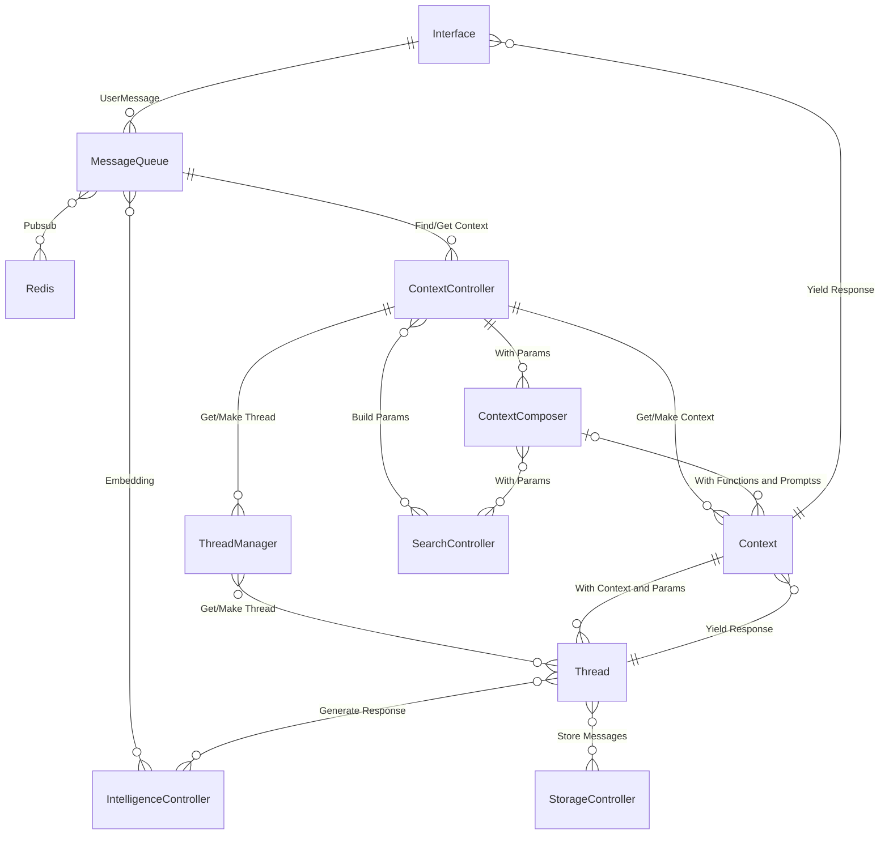

# Parsing

```mermaid
erDiagram
    Interface ||--o{ MessageQueue : "UserMessage"
    MessageQueue }o--o{ IntelligenceController : "Embedding"
    MessageQueue }o--o{ Redis : "Pubsub"
    MessageQueue ||--o{ ContextController : "Find/Get Context"
    ContextController ||--o{ Context : "Get/Make Context"
    ContextController ||--o{ ThreadManager : "Get/Make Thread"
    ThreadManager }o--o{ Thread : "Get/Make Thread"
    ContextController }o--o{ SearchController : "Build Params"
    ContextController ||--o{ ContextComposer : "With Params"
    ContextComposer }o--o{ SearchController : "With Params"
    ContextComposer |o--o{ Context : "With Functions and Promptss"
    Context ||--o{ Thread : "With Context and Params"
    Thread }o--o{ IntelligenceController : "Generate Response"
    Thread }o--o{ StorageController : "Store Messages"
    Thread ||--o{ Context : "Yield Response"
    Context ||--o{ Interface : "Yield Response"
```
